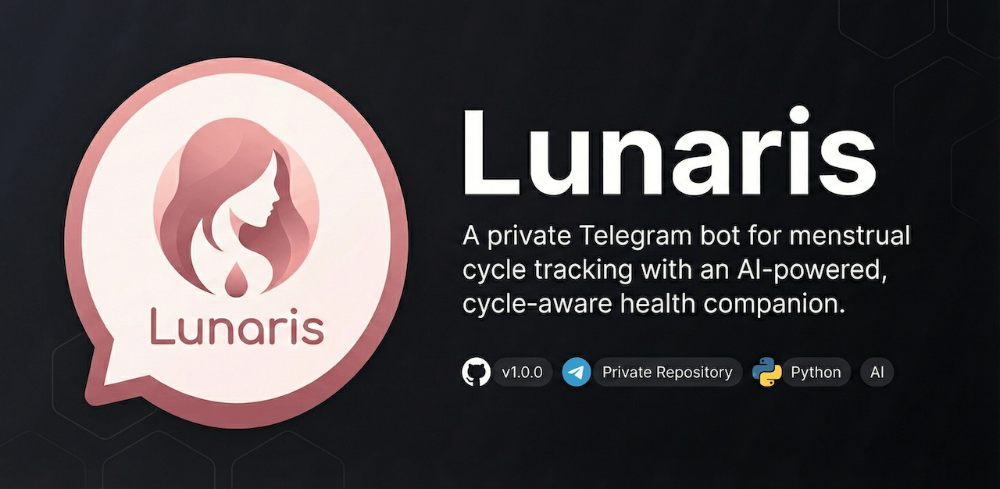

<p align="center">
  
</p>

<h1 align="center">Lunaris</h1>

<p align="center">
  A private Telegram bot for menstrual cycle tracking with an AI-powered, cycle-aware health companion.
</p>

<p align="center">
  
  
  
  
  
</p>

---

## Features

### Cycle Tracking & Predictions

- **5-phase cycle model** — menstruation, follicular, ovulation, luteal, PMS
- **Proportional phase boundaries** — scales phases based on actual cycle length using the medical model (fixed 14-day luteal phase), so a 35-day cycle puts ovulation on day 21, not day 14
- **Configurable period duration** (2-7 days) — phase boundaries adjust to your actual period length
- **Adaptive cycle learning** — computes median cycle length from your period history (falls back to 70/30 weighted average with fewer than 2 logged periods)
- **Period history log** — tracks every logged period for smarter predictions over time
- **Date predictions** — next period, PMS, and ovulation with countdown
- **Age-aware** — optional birth year for age-appropriate AI advice
- **Configurable** — cycle length (20-45 days), period duration, last period date, timezone

### AI Companion (Claude)

- **Personalized tips** — context-aware advice based on current phase, recent mood logs, and age
- **Free-form chat** — conversational AI for women's health questions (hormones, nutrition, exercise, sleep, skincare, fertility, symptoms)
- **Persistent memory** — per-user conversation history across sessions
- **Warm tone** — supportive and conversational, never clinical

### Mood & Symptom Logging

- Log daily notes with automatic phase tagging
- View history with dates and phase labels
- Logs feed into AI tips for better personalization

### Smart Daily Reminders

- Scheduled at a configurable hour (default 9 AM)
- Only triggers during key phases: menstruation, ovulation, PMS, and late luteal (proportional PMS warning)
- Uses Claude Haiku for cost-efficient reminder generation
- Incorporates recent mood logs and age for context

### Multi-User & Access Control

- Admin whitelist system with `/adduser` and `/removeuser`
- Per-user cycle config, mood logs, period history, and chat history
- 3-tier auth: whitelisted, configured (setup done), admin
- Admin commands hidden from non-admin users in the Telegram menu

---

## Commands

### User Commands

| Command | Description |
|---------|-------------|
| `/start` | Welcome message & main menu |
| `/status` | Current cycle day & phase |
| `/tip` | AI-generated tip for your phase |
| `/period [date]` | Log period start (today or specific date) |
| `/log <note>` | Log mood or symptom |
| `/history` | View recent logs |
| `/next` | Predicted upcoming dates |
| `/phase` | Detailed phase info & wellness tips |
| `/adjust <date>` | Update last period start date |
| `/settings [days]` | View or update cycle length |
| `/settings period <days>` | Update period duration (2-7) |
| `/settings age <year>` | Set birth year for age-aware tips |
| `/setup <length> <date> [period_duration] [birth_year]` | Initial cycle setup |
| `/clearchat` | Clear AI chat history |
| `/about` | Bot info & version |

### Admin Commands

| Command | Description |
|---------|-------------|
| `/adduser <id>` | Whitelist a Telegram user |
| `/removeuser <id>` | Remove a user |
| `/users` | List all whitelisted users |

### Interactive Menu

The `/start` command presents an inline keyboard with quick access to Status, Tip, Period, Next Dates, Phase Details, History, Chat, and Settings. Free-form text messages go directly to the AI chat — no command needed.

---

## Tech Stack

| Component | Technology |
|-----------|------------|
| Bot Framework | [python-telegram-bot](https://python-telegram-bot.org/) 21.10 |
| AI | [Anthropic Claude](https://www.anthropic.com/) (Sonnet for chat/tips, Haiku for reminders) |
| Database | SQLite 3 with WAL mode |
| Scheduler | APScheduler 3.10 |
| Process Manager | PM2 |
| CI/CD | GitHub Actions |
| Language | Python 3.12+ |

---

## Project Structure

```
lunaris-bot/
├── run.py                      # Entry point
├── config/
│   └── settings.py             # Environment config & constants
├── src/
│   ├── bot.py                  # App bootstrap & command registration
│   ├── handlers.py             # Command, button & chat handlers
│   ├── cycle.py                # Proportional phase engine & date predictions
│   ├── ai.py                   # Claude AI integration (age-aware)
│   ├── db.py                   # SQLite database layer (period history, migrations)
│   └── scheduler.py            # Daily reminder scheduling
├── tests/                      # 174 pytest tests
│   ├── conftest.py             # Shared fixtures
│   ├── test_cycle.py           # Cycle engine & proportional boundaries (48 tests)
│   ├── test_db.py              # Database layer & period logs (46 tests)
│   ├── test_ai.py              # AI integration (14 tests)
│   ├── test_handlers_helpers.py    # Auth & utilities (19 tests)
│   ├── test_handlers_commands.py   # Command handlers (31 tests)
│   └── test_scheduler.py       # Reminder logic (6 tests)
├── data/                       # SQLite database (runtime)
├── logs/                       # Log files (runtime)
└── Lunaris-header.png
```

---

## Setup

### Prerequisites

- Python 3.12+
- A Telegram bot token from [@BotFather](https://t.me/BotFather)
- An [Anthropic API key](https://console.anthropic.com/)

### Installation

```bash
git clone https://github.com/borghei/lunaris-bot.git
cd lunaris-bot

python -m venv venv
source venv/bin/activate
pip install -r requirements.txt

cp .env.example .env
```

### Configuration

Edit `.env` with your values:

```env
TELEGRAM_BOT_TOKEN=your_bot_token
ANTHROPIC_API_KEY=your_api_key
ADMIN_CHAT_ID=your_telegram_user_id

CYCLE_LENGTH=28
LAST_PERIOD_START=2026-01-28
REMINDER_HOUR=9
TIMEZONE=Asia/Tehran
```

### Run

```bash
python run.py
```

---

## Deployment

### PM2 (Production)

```bash
pm2 start ecosystem.config.js
pm2 logs lunaris
```

PM2 is configured with auto-restart, 256 MB memory limit, and log rotation.

### CI/CD

Pushes to `main` trigger automatic deployment via GitHub Actions:

1. Pull latest code on the server
2. Back up the database
3. Install dependencies
4. Syntax check
5. Generate `.env` from GitHub Secrets
6. Restart via PM2
7. Health check
8. Clean up old backups (7-day retention)

**Required GitHub Secrets:** `TELEGRAM_BOT_TOKEN`, `ANTHROPIC_API_KEY`, `ADMIN_CHAT_ID`, `DEPLOY_HOST`, `SSH_PRIVATE_KEY`

---

## Testing

```bash
pytest                  # Run all 174 tests
pytest -v               # Verbose output
pytest tests/test_cycle.py  # Run a specific module
```

Tests use real SQLite databases (via `tmp_path`) and mocked Anthropic calls. Async handlers are tested with `asyncio_mode = "auto"`.

---

## License

[MIT](LICENSE) — Amin Borghei
